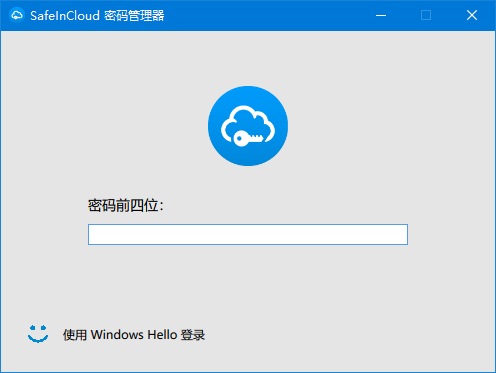
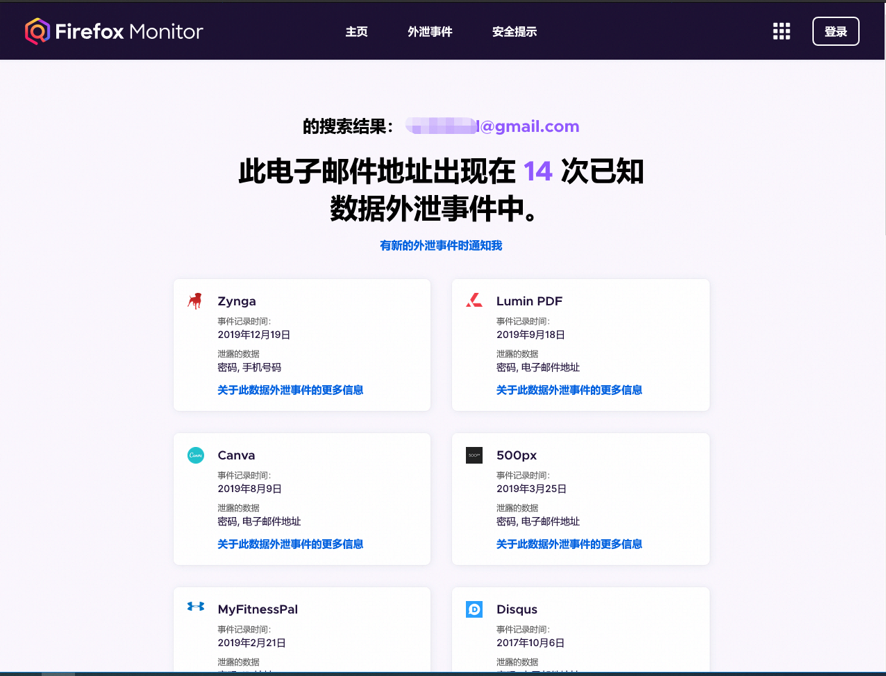

_太久没有更新博客，春节回来，尝试开始写一点点东西。_

昨天买了iOS和安卓平台的Safe in Cloud,所以把之前的密码内容整理一下。

## 密码策略

从HeartBleed漏洞，到后来CSDN密码泄露，到网易账户密码泄露，Yahoo用户信息泄露，Dropbox用户信息泄露。网络的各种密码泄露告诉我们，应该有一个良好的密码管理方案，养成良好的密码管理习惯，以下：

  1. 不同的网站使用不同的密码
  2. 不使用太简单的密码，如本人生日，123456，password或简单的英文单词，长度最好保证有8位以上，数字、字母和特殊符号组合。
  3. 使用双因素认证
  4. 定期修改密码

## 密码管理软件

使用密码管理软件进行密码的生成、保存和自动填写，不用担心不同的网站因密码不同而忘记密码。

### LastPass

密码管理软件我最开始使用的是LastPass，所有的数据直接保存在云端，有几乎所有平台的客户端和各种浏览器的插件，也是够用的。高级账户使用订阅的方式，价格也可以接受。在淘宝上可以购买正规途径的高级账户的订阅。
  
LastPass也是使用的网站登录的方式，之前也发生过数据库泄露的情况，所以目前已经弃用。

### 1Password

但是后来iOS和Mac使用较多之后，使用了1Password，1Password最初应该就是为Mac和iOS的设计的，对苹果支持较好。
  
1Password产品设计精良，目前也有iOS，Android（相对iOS客户端，Android客户端像个半成品）。

### Keepass

完全免费开源的软件，有官方和第三方的免费桌面客户端，无官方移动客户端，第三方移动客户端的质量难以保证，且一般为收费软件，多平台同步也是难以保证。

### Safe in Cloud

Safe in Cloud 是目前我正在使用的工具，移动端收费，桌面端免费，有Android，iOS，Mac，Windows平台客户端，支持使用常见网盘服务进行同步，我目前使用坚果云的WebDav进行同步[^1]。

Windows Store里面的Safe in Cloud现在已支持使用指纹验证登陆，是一个可选的内购。推荐购买。

**推荐Safe in Cloud.**

## 两步验证(双因素认证)

两步验证能极大提高账号的安全，就算密码泄露了，对方也无法直接使用账号和密码登录。因为两步验证有两个密码，一个是常规的密码，如果这个密码正确，会让你再输入一个工具生成的随机密码。两步认证或者叫做双因素认证，Two Factor Authenticator，即需要有两件事物的认证，你知道的 (what you know) 和你拥有的实物 (what you have) ，别人拿到你其中的一项，都无法登陆你的账号。常见的两步验证方式是使用谷歌的OTP。
 
### Authy
推荐使用 Authy 这个密码管理工具，兼容 Google Authenticator 的方式。有主流移动平台的客户端，包括Chrome扩展的桌面端。
使用手机进行注册，无需密码，换了手机或者手机丢失后，使用发送到手机的验证码进行登录。
 Authy登录无密码但是有一个加密的密码，登录后同步到数据需要输入解密密码才能看到双重验证的密码。
Safe in Cloud目前也自带有两步验证的功能，可以将目前两步的验证码都迁移到上面。

## Firefox Monitor

从我2009年开始上网，我的邮件地址注册的账号至少出现在了14次的账号泄露事件中，这个还只是被公开出来的。
推荐在[Firefox Monitor](https://monitor.firefox.com/)中添加自己的邮件地址，这样后续你的邮箱出现在泄露的数据库中时，你可以及时收到邮件通知。

关于网络账户最重要的一点：

**不同网站要使用不同的密码**

[^1]: 使用坚果云的WebDav进行同步：http://help.jianguoyun.com/?p=2622&#160