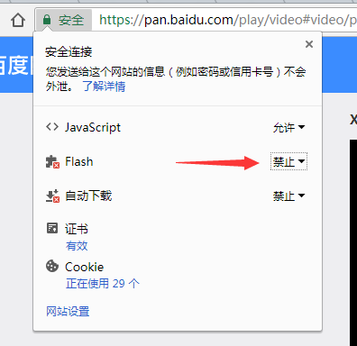

百度云现在支持使用HTML5的播放器，可以放弃使用Flash的播放器了，这样就给了可以定制它的空间了。

因为视频播放都习惯使用变速功能，所以给百度云的视频播放器写了一个Userscript，给百度云HTML5视频播放器添加变速功能，效果如下：

  1. 先安装插件[TamperMonkey][2]。
  2. 再访问 <BaiduPanVideoPlayerSpeedController.user.js> ,选择安装。

在地址栏中，禁用Chrome的flash功能即可生效。  

Update:

  1. 现在Chrome默认都是禁用Flash了，所以最后一步可以省略。
  2. 百度网盘的变速播放现在是一个超级会员的收费功能,有条件的请购买会员使用官方版本。

 [1]: https://blog-1253654195.cosgz.myqcloud.com/201712/201801-cloudSpeedChange_preview.jpg
 [2]: https://tampermonkey.net/
 [3]: https://blog-1253654195.cosgz.myqcloud.com/201712/201711-chrome_disable_flash.png