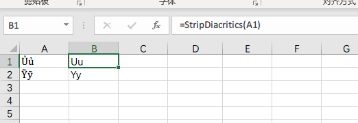

因为工作需要，整理越南资料时，需要将越南语中的音调去掉，变成英文字母，在网上找到的Excel VBA的方式，整理成Excel 宏文件模板。

  <a href="越南音标替换.xlsm">越南音标替换</a><a href="越南音标替换.xlsm" class="wp-block-file__button" download>下载</a>

## 使用方法

1.使用函数：下载上面这个启用宏的工作簿，并确保Excel已经启用了宏，则在这个Excel工作簿中可以直接使用`StripDiacritics`这个函数。这个函数返回的直接就是去掉音调后的文本。<figure class="wp-block-image">

<figcaption>使用StripDiacritics函数</figcaption></figure> 

2. 使用宏方法，选中需要去除音标的单元格，在视图标签中，选择宏，执行**`removeAccent`**。

<ul class="wp-block-gallery columns-1">
  <li class="blocks-gallery-item">
    <figure><figcaption>执行宏removeAccent</figcaption></figure>
  </li>
</ul>

演示中只选中了一个单元格，是可以处理多个单元格的。添加完这两个后，就不需要一个个手工调整越南音调的文本了。

  <iframe src="https://giphy.com/embed/11sBLVxNs7v6WA" width="100%" height="100%" style="position:absolute" frameBorder="0" class="giphy-embed" allowFullScreen></iframe>

[via GIPHY][1]

本文代码来源是： <https://stackoverflow.com/questions/10032322/excel-2007-vba-converting-accented-characters-to-regular>

 [1]: https://giphy.com/gifs/cheer-cheering-11sBLVxNs7v6WA