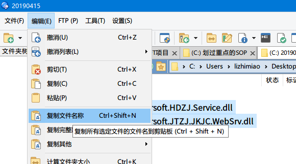
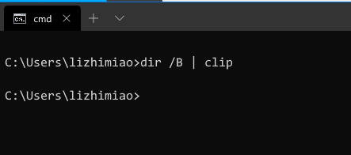

偶尔遇到要将一个文件夹中所有文件名复制出来的情况，如果有使用例如Directory Opus等文件管理软件，那么软件自带复制所有文件名功能。<figure class="wp-block-image size-large">

<figcaption>使用Directory Opus复制文件名</figcaption></figure> 

如果不安装任何软件有没有办法呢？

  1. 在Windows自带文件管理器空白处，按住SHIFT键右击鼠标，选择在此处打开命令行
  2. 输入命令`dir /B | clip`，按回车Enter键执行。
  3. 在任意需要粘贴的地方，按Ctrl + V粘贴即可。<figure class="wp-block-image size-large">

<figcaption>执行dir /b | clip，不会产生任何输出</figcaption></figure>